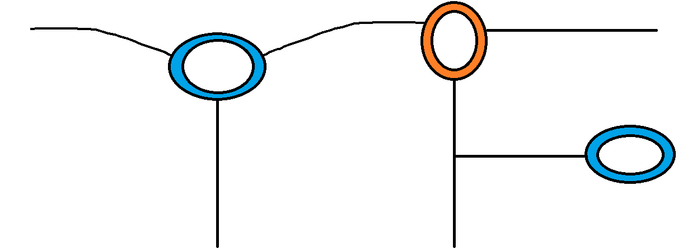

#   TopoFuzzer - A Network Topology Fuzzer 

-----------------------------------------

## :page_with_curl: What is TopoFuzzer?

TopoFuzzer is a gateway node with two main functionalities:
1. It assists your service (containers or VMs) migration and reinstantiation at the networking level, using an API to update the mapping between the public IP used by users and the private IP allocated to the new instance. The advantage of TopoFuzzer is the live handover of connections without having to re-establish them. This is critical for services with long lived connections.
2. It establishes a mininet network allowing for dynamic changes of the network topology to disrupt reconnaissance and scanning of external and internal users.

You can read a detailed presentation of TopoFuzzer

## :clipboard: Features

- REST API to update the mapping between the public IP and the private IP of a service
- Instant handover of TCP connections: _e.g.,_ HTTP/2
- Instant handover of UDP connections: _e.g.,_ QUIC, HTTP/3
- No TLS certificates handling needed for HTTPS/3
- Add and remove nodes, switches, and links dynamically with the mininet API
- Change the traffic flow in the data plane by connecting an external SDN controller 


## :hammer_and_pick: Quick Start

**PREREQUIREMENTS:**
- install redis and configure it to get connected with the external IP of the host (not 127.0.0.1)

**INSTALL:**
- install with pip

**DEPLOY:**
1. change the file `settings.py` to put the host IP and the redis port in the correspondent field `TOPOFUZZER_IP` and `REDIS_PORT` (default port is 6379)
2. create an admin user with the command ```python manage.py createsuperuser```
3. start the server with the command ````python manage.py runserver 0:8000````, which starts the TopoFuzzer REST API interface 

**Deploy the mininet _"fuzzing network"_ with isolated redirection proxies per service**

4. start the TopoFuzzer mininet middle network and the redirection proxies per service with the command ````python manage.py proxy_handler_main --sdnc-ip <SDNC>```` where _\<SDNC\>_ is the IP or the hostname of the external SDN controller


**Deploy a single redirection proxy for all services (available in v0.2)**

This option is convenient when the isolation of traffic between services is not relevant and allows to reduce the CPU consumption by at least 20 fold (for 4 services and over). The main reason is that only one proxy and listener is deployed for all the services.
4. Add TPROXY mangling rule with the command ````sudo iptables -t mangle -I PREROUTING ! -s <host_IP> -d <services_public_IP_range> -p tcp -j TPROXY --on-port=5555 --on-ip=127.0.0.1````
5. add _net_admin_ rights to the redirection proxy with ````sudo setcap cap_net_raw,cap_net_admin=eip proxy_handler/management/commands/singleHostProxy.py````
6. Start the single redirection proxy using the command ````sudo python manage.py singleHostProxy````


## :book: Usage and documentation:
Now you can transfer open connections to different instances of your service dynamically and control the mininet middle-network using your SDNC.
More details on the deployment, the usage of TopoFuzzer, and the description of the REST API interface is detailed in the Wiki/Documentation here: [Wiki](https://github.com/wsoussi/TopoFuzzer/wiki)