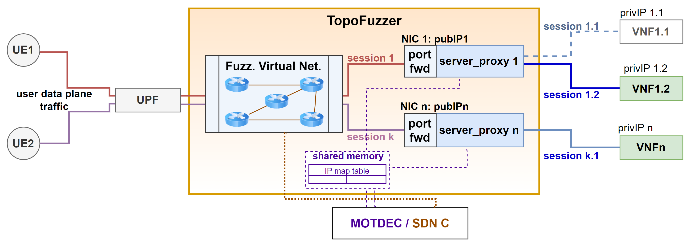

# Network Topology Fuzzer (TopoFuzzer)

## What is TopoFuzzer?

TopoFuzzer is a network gateway node dynamically deployable in the cloud as a Virtual Network Function (VNF) with two main functionalities:
1. It assists your service (containers or VMs) migration and reinstantiation at the networking level, mapping the public IP used by users to connect and the private IP allocated to the new instance. The advantage of TopoFuzzer is the live handover of connections without having to close them and re-establish them. This is critical for a seamless migration of services with long lived connections.
2. It establishes a mininet network allowing for dynamic changes of the network topology to disrupt reconnaissance and scanning of external and internal attackers with Moving Target Defense (MTD) strategies.

## Features

- REST API to update the mapping between the public IP and the private IP of a service
- Instant handover of TCP connections: _e.g.,_ HTTP/2
- Instant handover of UDP connections: _e.g.,_ QUIC, HTTP/3
- No TLS certificates needed for HTTPS/3 (no trust on the intermediary needed)
- Add and remove nodes, switches, and links dynamically with the mininet API
- Change the traffic paths in the data plane by connecting an external SDN controller 

## Architecture

The TopoFuzzer architecture depicted in this Figure comprises three main components: 1) The IP mapping table mapping the public IP to the private IP, 2) The redirection
module composed of multiple proxy-NICs, and 3) The Fuzzing Virtual Network allowing to implement Soft MTD actions (_i.e.,_ which do not require to move the service instance).
The architecture considers a controller (MOTDEC) that performs the migration and re-instantiation of the services and give to the TopoFuzzer the private IP of the new instance when this is available, allowing for a continuity of the service provision.

TopoFuzzer was built in the scope of a modern telcoCloud environment (5G and Beyond), hence the use of terminologies such User Equipment (UE) for the clients, User Plane Function (UPF) for the data plane traffic management, and VNF for the services.
Nevertheless, TopoFuzzer is suitable for any cloud-based infrastructure wanting to adopt network MTD strategies.

### Long Lived Connection Handover

 when dealing with TCP based traffic, each packet is bound to a connection defined by the tuple
(src ip, src port, dst ip, dst port). Using simple DNAT to redirect traffic will work only for newly established connections, while old ones are waited to terminate.
This makes the traffic handover of long lived connection based services unfeasible, while also increasing the resource consumption as two instances of the same service has to be maintained.
With TopoFuzzer this is solved via a 2-socket connection, so when the new instance is ready the traffic is immidiately moved to the new instance without disrupting any connection.
While the TopoFuzzer procedure uses a similar design to reverse-proxies, it guarantees a smooth connection handover and doesn't limit the redirection to specific ports but to all ports of the service 
 (_i.e.,_ firewall rules can be applied before or after the traffic passes the TopoFuzzer gateway).

### Lightweight Network Topology Fuzzing

without affecting the real network topology but changing the topology view from the client perspective (e.g., if they scanned the network with tools
like traceroute and nmap), a virtual network composed of switching and routing nodes is placed between the proxy nodes
and the User Plane Function (UPF). Adding a gateway in the route, removing one, or replacing it with another gateway, are
all operations that affect only the visible session to the clients. In contrast, the sessions from the out sockets of the proxy
nodes to the VNFs are internal by nature, hence, not modified. These operations can be enforced by using an SDN controller
connected to the switches of the Fuzzing Virtual Network.
Finally, the usage of mininet hosts as the traffic redirectors allow a better isolation of each service traffic and reduce

### REST API

The RESTful API allows the administrator to add and remove services to provide via TopoFuzzer, as well as updating the mapping between their public IP and private IP.
A lightweight web UI allows the administrator to get access to the GUI REST API interface provided by the Django RESTFramework.
Refer to the [REST API page](api) for a detailed documentation of the REST interface.
