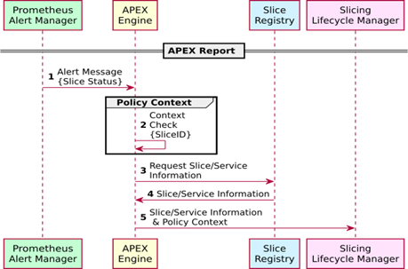
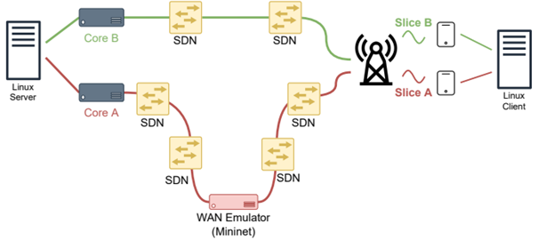

# Policy Systems

Katana Slice Manager supports external Policy Systems. Regarding the type of the Policy System, Slice Manager will provide the respective set of functionalities. The supported Policy Systems are listed below:

## 1. APEX

### 1.1 Introduction

Katana Slice Manager supports an integrated Slice Optimization Module. This module allows for the slice optimization process, driven by the [APEX policy engine](https://docs.onap.org/en/dublin/submodules/policy/apex-pdp.git/docs/APEX-Introduction.html). This process is triggered by the Prometheus Alert Manager’s alerts, which runs as part of the Slice Monitoring module. A use case scenario for this module is when the Slice Monitoring module detects a failure on a part of a running slice and sends an alert to the APEX policy engine. APEX processes the incoming request and recommends appropriate actions, such as restarting a virtual network service, modifying the transport network paths, etc. The UML diagram below presents the flow of actions that corresponds to such a use case scenario.



### 1.2 Deployment

APEX is integrated into the Katana software stack as a Docker container. To deploy the APEX container along with other Katana services, use the flag `--apex` on the `deploy.sh` script:

```bash
bash bin/deploy.sh --apex -m
```

> Note that the monitoring module is required to support the APEX services

### 1.3 Use case

Currenlt, the integrated APEX engine supports the use-case where a virtual Network Services(NS) that is part of a slice is having some issues. The APEX policy used for this use-case considers three scenarios: (1) if the concerned slice has no previous history of failure, the slice manager attempts to correct the issue by restarting the misbehaving NS, (2) if the slice has a history of failure, the slice manager will restart the slice with new parameters and restrictions, such as relocating the NS on a new infrastructure component, and also notifies the NEAT system on the UE of the failure, which can then take immediate action to try and resolve the issue at the UE side. Once the slice manager has resolved the issue, NEAT is once again notified, and (3) if the slice has a history of failure, as well as a history of failed attempts to correct the issue, the slice manager is instructed to notify the system admin as well as any NEAT agent available on the connected UEs, and terminates the whole Slice. In scenarios 2 and 3, the NEAT policy systems will redirect the network traffic over the failing slice to another slice (if available), until the issue has been resolved.
The Slice Manager monitoring system detects the NS failure and applies the policy instructed by APEX; it restarts the said NS and immediately notifies the NEAT components on the UEs connected to this Slice. On the UE side, NEAT intervenes and reconfigures the UE connectivity over a backup Slice (if available) until the affected NS is restarted and connectivity on the primary Slice is restored. However, the software error persists, causing the NS to fail again. At that point, APEX applies another policy on the Slice Manager, terminating the Slice A with the malfunctioning NS. Moreover, NEAT is once again notified and permanently reroutes the traffic over the backup Slice (if available). As a result, we achieve the minimum connectivity disruption while achieving the maximum throughput whenever possible.

## 2. NEAT

### 2.1 Introduction

The NEAT system runs on the UE, and decouples applications from the underlying network stack. It allows the choice of transport protocol, its configuration, and the choice of network slice usage to be made dynamically based on the application’s requirements, as well as the current network configuration and status, obtained from the slice manager. NEAT UE Policy System will contact the Slice Manager in order to request the slice parameters. The NEAT then will perform a policy configuration to the UE node.



### 2.1 Deployment

The NEAT policy system is deployed and operating on the UE site. You can read more details about the NEAT deployment options on the official [NEAT website](https://www.neat-project.org/).

To register a running NEAT agent to Katana, use the respective API: [http://katana_ip:8000/api/policy](http://katana_ip:8000/api/policy)

### 2.1 Use case

Refer to the paper [Extending Network Slice Management to the End-host](https://www.academia.edu/49680190/Extending_Network_Slice_Management_to_the_End_host) for details about the specified use case.
