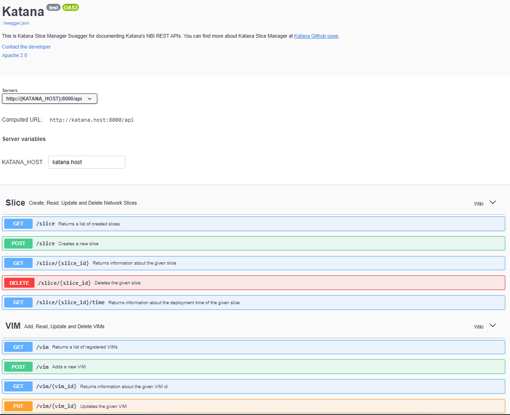

# Swagger UI

Katana Slice Manager uses a Swagger UI tool in order to document the NBI RESTful APIs, as depicted in figure below. You can reach the Swagger UI at [http://<katana_IP>:8001](http://<katana_IP>:8001).

To interact with the Katana Slice Manager via Swagger, fill the *KATANA_HOST* field with the IP Address or Domain Name of the host where Katana is deployed.

