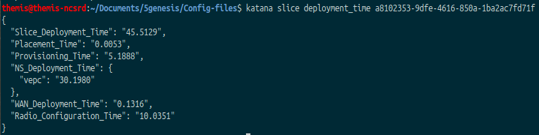

# Deployment Time Measurements

## Measurements

Slice manager measures the deployment and configuration time of an end-to-end slice, as well as subsets of that time, as they are enlisted below:

- Slice Deployment Time
- Per Network Service Deployment Time
- Transport Network Configuration Time
- Radio Components Configuration Time
- VNF Placement Time
- Resource Provisioning Time

## Usage

### NBI API

Use the following API:

| Method | URL |
| ------ | ------ |
| GET | [http://<slice_manager_ip>:8000/api/slice/<slice_id>/time] |

### CLI tool

`katana slice deployment_time <slice_id>`
